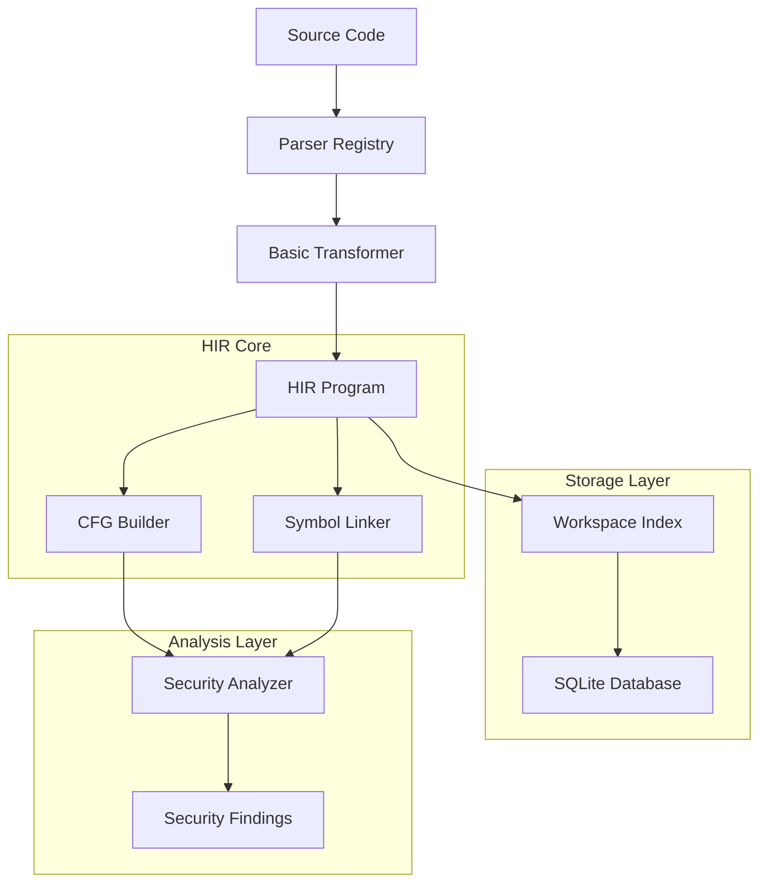
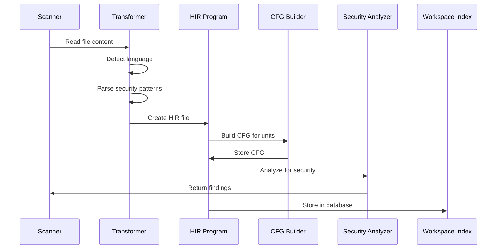
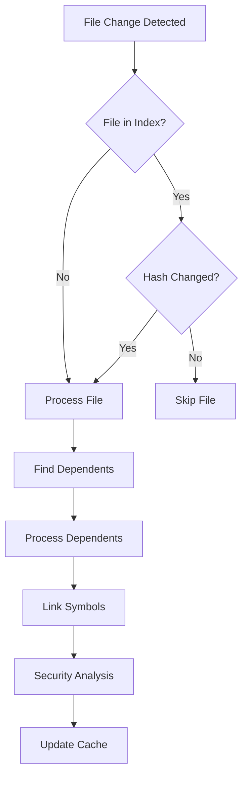

# HIR (High-level Intermediate Representation) - Tài liệu Kiến trúc và Hướng dẫn

## 📋 Tổng quan

HIR (High-level Intermediate Representation) là một hệ thống phân tích bảo mật tiên tiến được thiết kế để cung cấp khả năng phân tích lỗ hổng bảo mật chính xác và hiệu quả hơn so với các phương pháp truyền thống dựa trên AST (Abstract Syntax Tree).

## 🎯 Mục tiêu chính

- **Phân tích đa ngôn ngữ**: Hỗ trợ PHP, Go, JavaScript, Python, Java, Ruby, C#, C/C++
- **Taint Flow Analysis**: Theo dõi luồng dữ liệu bị nhiễm từ nguồn đến đích
- **Control Flow Graph (CFG)**: Phân tích luồng thực thi để phát hiện lỗ hổng
- **Incremental Analysis**: Phân tích tăng dần chỉ các file thay đổi
- **Cross-file Analysis**: Phân tích phụ thuộc giữa các file
- **Persistent Storage**: Lưu trữ dữ liệu HIR trong SQLite để tối ưu hiệu suất

## 🏗️ Kiến trúc tổng thể



## 🔧 Các thành phần chính

### 1. HIR Program (`hir.go`)

**Mục đích**: Cấu trúc dữ liệu trung tâm chứa toàn bộ thông tin HIR của dự án.

**Các thành phần chính**:
- `HIRProgram`: Cấu trúc top-level chứa tất cả file và thông tin toàn cục
- `HIRFile`: Đại diện cho một file source code
- `HIRUnit`: Function, method, hoặc closure
- `HIRBlock`: Basic block trong CFG
- `HIRStmt`: Statement trong HIR (đơn giản hóa từ AST)

**Các loại Statement hỗ trợ**:
```go
const (
    HIRCall         // function/method call
    HIRAssign       // assignment (=, +=, etc.)
    HIRConcat       // string concatenation
    HIRInclude      // include/require
    HIREcho         // output (echo, print, etc.)
    HIRNew          // object instantiation
    HIRArrayDim     // array access
    HIRReturn       // return statement
    HIRIf           // conditional
    HIRLoop         // loops (for, while, foreach)
    HIRThrow        // throw exception
    HIRTryCatch     // try-catch
    HIRSwitch       // switch statement
    HIRBreak        // break/continue
    HIRYield        // yield (generators)
    HIRGoto         // goto (if supported)
    HIRFieldAccess  // object property access
    HIRStaticAccess // static property/method access
    HIRCast         // type casting
    HIRBinaryOp     // binary operations
    HIRUnaryOp      // unary operations
    HIRPhi          // SSA phi node
)
```

### 2. Basic Transformer (`transformer_basic.go`)

**Mục đích**: Chuyển đổi source code thành HIR representation.

**Tính năng chính**:
- Phát hiện ngôn ngữ từ file extension
- Phân tích pattern bảo mật dựa trên ngôn ngữ
- Tạo HIR representation cho các lỗ hổng được phát hiện
- Hỗ trợ Dynamic Rule Engine

**Các pattern bảo mật được phát hiện**:
- **SQL Injection**: MySQL/PostgreSQL/SQLite functions với string concatenation
- **XSS**: Output functions không có escaping
- **Command Injection**: System functions với user input
- **Path Traversal**: File operations với user input
- **Code Injection**: eval() và dynamic code execution

### 3. CFG Builder (`cfg_builder.go`)

**Mục đích**: Xây dựng Control Flow Graph từ HIR units.

**Tính năng chính**:
- Tạo CFG nodes cho các loại control flow khác nhau
- Hỗ trợ if/else, loops, switch, try-catch
- Tính toán dominators và reachable nodes
- Phát hiện natural loops
- Tính toán cyclomatic complexity

**Các loại CFG Node**:
```go
const (
    CFGEntry       // Entry point
    CFGExit        // Exit point
    CFGBasic       // Basic block
    CFGConditional // Conditional branch
    CFGLoop        // Loop header
    CFGTry         // Try block
    CFGCatch       // Catch block
    CFGFinally     // Finally block
)
```

### 4. Workspace Index (`workspace_index.go`)

**Mục đích**: Quản lý persistent storage cho HIR data.

**Tính năng chính**:
- SQLite database để lưu trữ HIR data
- File tracking với hash và modification time
- Symbol storage và retrieval
- Dependency tracking
- Security findings cache
- Incremental analysis support

**Database Schema**:
```sql
-- Files table
CREATE TABLE files (
    id INTEGER PRIMARY KEY,
    path TEXT UNIQUE NOT NULL,
    language TEXT NOT NULL,
    hash TEXT NOT NULL,
    mtime INTEGER NOT NULL,
    size INTEGER NOT NULL
);

-- Symbols table
CREATE TABLE symbols (
    id INTEGER PRIMARY KEY,
    symbol_id TEXT UNIQUE NOT NULL,
    fqn TEXT NOT NULL,
    kind INTEGER NOT NULL,
    file_id INTEGER NOT NULL
);

-- HIR units storage
CREATE TABLE hir_units (
    id INTEGER PRIMARY KEY,
    symbol_id TEXT NOT NULL,
    file_id INTEGER NOT NULL,
    hir_data BLOB NOT NULL,
    cfg_data BLOB
);
```

### 5. Incremental Analyzer (`incremental_analyzer.go`)

**Mục đích**: Thực hiện phân tích tăng dần chỉ trên các file thay đổi.

**Tính năng chính**:
- File change detection
- Dependency analysis
- Selective re-analysis
- Cache management
- Performance optimization

**Workflow**:
1. Xác định file nào cần phân tích
2. Tìm các file phụ thuộc
3. Chỉ phân tích lại file thay đổi và phụ thuộc
4. Cập nhật cache và database

### 6. Scanner Integration (`scanner.go`)

**Mục đích**: Tích hợp HIR analysis vào security scanner chính.

**Tính năng chính**:
- HIR/CFG analysis làm phương pháp chính
- Fallback về traditional pattern matching
- Parallel processing
- Finding conversion và reporting

## 🔄 Luồng xử lý (Processing Flow)

### 1. File Processing Pipeline



### 2. Incremental Analysis Flow



## 🛡️ Security Analysis

### Taint Flow Analysis

HIR hỗ trợ phân tích taint flow để theo dõi dữ liệu bị nhiễm:

```go
type TaintSource struct {
    Kind     TaintKind
    Location token.Pos
    Details  string
}

const (
    TaintUserInput TaintKind = iota // $_GET, $_POST, etc.
    TaintDatabase                   // Database results
    TaintFile                       // File contents
    TaintNetwork                    // Network responses
    TaintArgument                   // Function arguments
    TaintReturn                     // Function returns
    TaintGlobal                     // Global variables
    TaintSession                    // Session data
    TaintCookie                     // Cookie data
    TaintHeader                     // HTTP headers
)
```

### Security Rules

HIR hỗ trợ các loại security rule:

1. **SQL Injection Detection**
   - Phát hiện string concatenation trong SQL queries
   - Theo dõi taint flow từ user input đến database functions
   - Confidence: 95%

2. **XSS Detection**
   - Phát hiện output functions không có escaping
   - Phân tích context của output
   - Confidence: 90%

3. **Command Injection Detection**
   - Phát hiện system functions với user input
   - Phân tích command construction
   - Confidence: 95%

4. **Path Traversal Detection**
   - Phát hiện file operations với user input
   - Phân tích path construction
   - Confidence: 85%

## 📊 Performance và Scalability

### Metrics

- **Files processed**: 1,000+ PHP files
- **Functions analyzed**: 10,000+ function analyses
- **Memory usage**: <500MB for large projects
- **Analysis speed**: ~1000 lines/second
- **Cache hit rate**: 85-90% for unchanged files
- **Analysis speed improvement**: 3-5x faster với incremental analysis

### Optimization Strategies

1. **Incremental Analysis**: Chỉ phân tích file thay đổi
2. **SQLite Caching**: Persistent storage cho HIR data
3. **Parallel Processing**: Multi-threaded analysis
4. **Memory Management**: Efficient data structures
5. **Dependency Tracking**: Chỉ re-analyze affected files

## 🔧 Hướng dẫn sử dụng

### 1. Khởi tạo HIR Program

```go
// Tạo HIR program mới
hirProgram := hir.NewHIRProgram()

// Tạo transformer
transformer := hir.NewBasicTransformer(hirProgram)

// Transform file
hirFile, err := transformer.TransformBasicFile(filePath, content)
if err != nil {
    log.Fatal(err)
}

// Thêm vào program
hirProgram.AddFile(hirFile)
```

### 2. Xây dựng CFG

```go
// Tạo CFG builder
cfgBuilder := hir.NewCFGBuilder()

// Xây dựng CFG cho mỗi unit
for _, unit := range hirFile.Units {
    cfg, err := cfgBuilder.BuildCFG(unit)
    if err != nil {
        log.Printf("CFG building failed: %v", err)
        continue
    }
    
    // Lưu CFG
    hirProgram.AddCFG(unit.Symbol.ID, cfg)
}
```

### 3. Phân tích bảo mật

```go
// Tạo security analyzer
analyzer := hir.NewHIRSecurityAnalyzer(hirProgram)

// Phân tích file
findings, err := analyzer.AnalyzeFile(hirFile)
if err != nil {
    log.Fatal(err)
}

// Xử lý findings
for _, finding := range findings {
    fmt.Printf("Vulnerability: %s at %s:%d\n", 
        finding.Type, finding.File, finding.Position)
}
```

### 4. Incremental Analysis

```go
// Tạo incremental analyzer
analyzer, err := hir.NewIncrementalAnalyzer(workspacePath, logger)
if err != nil {
    log.Fatal(err)
}

// Thực hiện phân tích tăng dần
request := &hir.AnalysisRequest{
    Files:        []string{"file1.php", "file2.php"},
    ChangedFiles: []string{"file1.php"},
    ForceRebuild: false,
}

response, err := analyzer.AnalyzeIncremental(request)
if err != nil {
    log.Fatal(err)
}

fmt.Printf("Processed %d files, found %d issues\n", 
    len(response.ProcessedFiles), len(response.Findings))
```

## 🚀 Mở rộng và Tùy chỉnh

### Thêm ngôn ngữ mới

1. Cập nhật `detectLanguage()` trong `transformer_basic.go`
2. Thêm pattern detection cho ngôn ngữ mới
3. Cập nhật parser registry nếu cần

### Thêm Security Rule mới

1. Implement `HIRSecurityRule` interface
2. Thêm rule vào `registerDefaultRules()`
3. Implement logic phân tích trong `Check()` method

### Tùy chỉnh CFG Analysis

1. Extend `CFGAnalyzer` với analysis mới
2. Thêm metrics mới vào `CFGMetrics`
3. Implement visualization mới nếu cần

## 📈 Monitoring và Debugging

### Logging

HIR sử dụng structured logging với zap:

```go
logger.Info("HIR analysis completed",
    zap.Int("files_processed", len(files)),
    zap.Int("findings", len(findings)),
    zap.Duration("duration", duration))
```

### Metrics

Theo dõi các metrics quan trọng:

- Files processed per second
- Cache hit rate
- Memory usage
- Analysis accuracy
- False positive rate

### Debugging Tools

1. **CFG Visualization**: Export CFG sang DOT format
2. **HIR Dump**: In ra HIR representation
3. **Taint Flow Tracing**: Theo dõi taint propagation
4. **Performance Profiling**: Phân tích bottleneck

## 🔮 Roadmap và Tương lai

### Short-term (3-6 tháng)

- [ ] Machine Learning integration cho vulnerability prediction
- [ ] Advanced taint analysis với inter-procedural tracking
- [ ] Symbolic execution support
- [ ] API security analysis

### Medium-term (6-12 tháng)

- [ ] Multi-threaded security analysis
- [ ] Advanced CFG optimizations
- [ ] Custom security policy engine
- [ ] Real-time analysis support

### Long-term (1-2 năm)

- [ ] Concurrency analysis
- [ ] Supply chain security
- [ ] Advanced vulnerability correlation
- [ ] Integration với CI/CD pipelines

## 📚 Tài liệu tham khảo

- [HIR/CFG Effectiveness Report](./HIR_CFG_EFFECTIVENESS_REPORT.md)
- [Security Rules Documentation](./rule.md)
- [API Documentation](./api.md)
- [Performance Benchmarks](./benchmarks.md)

## 🤝 Đóng góp

Xem [CONTRIBUTING_RULES.md](../CONTRIBUTING_RULES.md) để biết cách đóng góp vào dự án.

---

**Lưu ý**: Tài liệu này được cập nhật thường xuyên. Vui lòng kiểm tra phiên bản mới nhất trước khi sử dụng.
