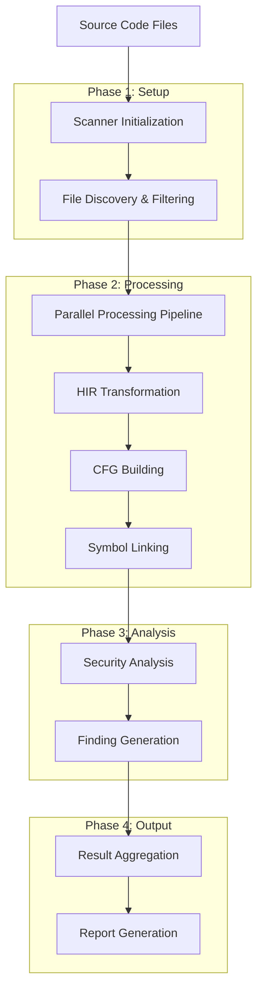

# HIR Flow Run Guide - Hướng dẫn Luồng Chạy Chi tiết

## 📋 Tổng quan

Tài liệu này mô tả chi tiết luồng chạy của hệ thống HIR (High-level Intermediate Representation) từ khi nhận source code đến khi tạo ra security findings.

## 🔄 Luồng chạy tổng thể



## 🚀 Phase 1: Setup và Initialization

### 1.1 Scanner Initialization

```go
// Khởi tạo scanner với config
scanner := scanner.New(config, logger)

// Cấu trúc bên trong:
type Scanner struct {
    config         *config.Config
    logger         *zap.Logger
    ruleEngine     *rules.RuleEngine
    parserRegistry *parser.ParserRegistry
    hirProgram     *hir.HIRProgram
    hirTransformer *hir.BasicTransformer
}
```

**Các bước khởi tạo**:
1. Tạo HIR Program mới
2. Khởi tạo Global Symbol Table
3. Tạo Call Graph
4. Khởi tạo CFG storage
5. Tạo Dependency Graph
6. Tạo Include Graph
7. Khởi tạo Basic Transformer

### 1.2 File Discovery & Filtering

```go
// Walk directory và filter files
func (s *Scanner) walkDirectory(ctx context.Context, jobs chan<- *FileJob, result *ScanResult) error {
    return filepath.WalkDir(s.config.ScanPath, func(path string, d fs.DirEntry, err error) error {
        // Check file extensions
        if !s.shouldProcessFile(path) {
            return nil
        }
        
        // Check ignore patterns
        if s.shouldIgnorePath(path) {
            return filepath.SkipDir
        }
        
        // Create file job
        job := &FileJob{
            Path:     path,
            Content:  content,
            Language: s.detectLanguage(path),
        }
        
        jobs <- job
        return nil
    })
}
```

**File filtering logic**:
- Kiểm tra file extension (`.php`, `.go`, `.js`, etc.)
- Loại bỏ files trong excluded directories
- Kiểm tra file size limits
- Validate file permissions

## ⚙️ Phase 2: Parallel Processing Pipeline

### 2.1 Worker Pool Setup

```go
// Tạo worker pool
var wg sync.WaitGroup
for i := 0; i < s.config.Parallel; i++ {
    wg.Add(1)
    go s.worker(ctx, &wg, fileJobs, findings)
}
```

**Worker function**:
```go
func (s *Scanner) worker(ctx context.Context, wg *sync.WaitGroup, jobs <-chan *FileJob, findings chan<- *Finding) {
    defer wg.Done()
    
    for {
        select {
        case <-ctx.Done():
            return
        case job, ok := <-jobs:
            if !ok {
                return
            }
            s.processFile(job, findings)
        }
    }
}
```

### 2.2 File Processing

```go
func (s *Scanner) processFile(job *FileJob, findings chan<- *Finding) {
    // Primary approach: HIR/CFG Analysis
    hirFindings, hirErr := s.analyzeWithHIR(job)
    if hirErr == nil && len(hirFindings) > 0 {
        for _, finding := range hirFindings {
            findings <- finding
        }
        return // HIR analysis succeeded
    }
    
    // Fallback: Traditional pattern matching
    if hirErr != nil {
        // Run traditional security rules
        for _, rule := range enabledRules {
            fileFindings := s.checkRuleTraditional(rule, job, symbolTable)
            for _, finding := range fileFindings {
                findings <- finding
            }
        }
    }
}
```

## 🔄 Phase 3: HIR Transformation

### 3.1 Basic Transformation Process

```go
func (t *BasicTransformer) TransformBasicFile(filePath string, content []byte) (*HIRFile, error) {
    // 1. Detect language
    language := t.detectLanguage(filePath)
    
    // 2. Create HIR file structure
    hirFile := &HIRFile{
        Path:     filePath,
        Language: language,
        Symbols:  make([]*Symbol, 0),
        Units:    make([]*HIRUnit, 0),
        Includes: make([]*Include, 0),
    }
    
    // 3. Parse file content
    t.parseFileContent(hirFile, content)
    
    return hirFile, nil
}
```

### 3.2 Security Pattern Detection

**SQL Injection Detection**:
```go
func (t *BasicTransformer) findSQLInjectionPatterns(hirFile *HIRFile, content string, lines []string) {
    sqlPatterns := []*regexp.Regexp{
        // Direct MySQL/PostgreSQL/SQLite functions with string concatenation
        regexp.MustCompile(`(?i)(mysql_query|mysqli_query|pg_query|sqlite_exec)\s*\(\s*[^,)]*[\.\+]\s*\$[a-zA-Z_][a-zA-Z0-9_]*`),
        
        // PDO or ORM query methods with direct variable interpolation
        regexp.MustCompile(`(?i)->query\s*\(\s*["'].*\$[a-zA-Z_][a-zA-Z0-9_]*.*["']\s*\)`),
        
        // SQL strings with direct variable interpolation
        regexp.MustCompile(`(?i)["']\s*(SELECT|INSERT|UPDATE|DELETE)\s+.*\$[a-zA-Z_][a-zA-Z0-9_]*.*["']`),
    }
    
    for lineNum, line := range lines {
        for _, pattern := range sqlPatterns {
            if pattern.MatchString(line) && t.isLikelySQLInjection(line) {
                t.createSQLInjectionHIR(hirFile, lineNum+1, line)
            }
        }
    }
}
```

**XSS Detection**:
```go
func (t *BasicTransformer) findXSSPatterns(hirFile *HIRFile, content string, lines []string) {
    xssPatterns := []*regexp.Regexp{
        // Direct echo/print with user input
        regexp.MustCompile(`(?i)(echo|print)\s+.*\$_(GET|POST|REQUEST|COOKIE)\s*\[`),
        
        // HTML output without escaping
        regexp.MustCompile(`(?i)<[^>]*>\s*\$_(GET|POST|REQUEST|COOKIE)\s*\[`),
    }
    
    for lineNum, line := range lines {
        for _, pattern := range xssPatterns {
            if pattern.MatchString(line) && t.isLikelyXSS(line) {
                t.createSecurityVulnerabilityHIR(hirFile, lineNum+1, line, "Cross-Site Scripting (XSS)")
            }
        }
    }
}
```

### 3.3 HIR Unit Creation

```go
func (t *BasicTransformer) createSecurityVulnerabilityHIR(hirFile *HIRFile, lineNum int, line string, riskType string) {
    // 1. Create symbol for vulnerability
    symbol := &Symbol{
        ID:       SymbolID(fmt.Sprintf("%s::line_%d", hirFile.Path, lineNum)),
        FQN:      fmt.Sprintf("line_%d", lineNum),
        Kind:     SymFunction,
        File:     hirFile.Path,
        Position: token.Pos(lineNum),
        Traits: SymbolTraits{
            Visibility: VisPublic,
            IsStatic:   false,
        },
        Meta: map[string]interface{}{
            "vulnerability_type": riskType,
        },
    }
    
    // 2. Add to file symbols
    hirFile.Symbols = append(hirFile.Symbols, symbol)
    
    // 3. Create HIR unit
    unit := &HIRUnit{
        Symbol:  symbol,
        Params:  make([]*Variable, 0),
        Returns: make([]*Variable, 0),
        Body:    t.createVulnerableBlock(lineNum, line, riskType),
        IsSSA:   false,
    }
    
    // 4. Add to file units
    hirFile.Units = append(hirFile.Units, unit)
}
```

## 🏗️ Phase 4: CFG Building

### 4.1 CFG Builder Process

```go
func (cb *CFGBuilder) BuildCFG(unit *HIRUnit) (*CFG, error) {
    cfg := &CFG{
        Nodes:    make(map[BlockID]*CFGNode),
        Edges:    make([]*CFGEdge, 0),
        Function: unit.Symbol,
    }
    
    // 1. Create entry and exit nodes
    entry := cb.createNode(CFGEntry, nil)
    exit := cb.createNode(CFGExit, nil)
    cfg.Entry = entry
    cfg.Exit = exit
    
    // 2. Build CFG from function body
    if unit.Body != nil {
        startNode := cb.buildBlockCFG(unit.Body, entry, exit)
        if startNode != entry {
            cb.addEdge(entry, startNode, nil, CFGFallthrough)
        }
    } else {
        // Empty function - connect entry to exit
        cb.addEdge(entry, exit, nil, CFGFallthrough)
    }
    
    return cfg, nil
}
```

### 4.2 Control Flow Analysis

**If Statement CFG**:
```go
func (cb *CFGBuilder) buildIfCFG(stmt *HIRStmt, current, exit *CFGNode) *CFGNode {
    condNode := cb.createNode(CFGConditional, nil)
    cb.addEdge(current, condNode, nil, CFGFallthrough)
    
    // Create nodes for then and else branches
    thenNode := cb.createNode(CFGBasic, nil)
    elseNode := cb.createNode(CFGBasic, nil)
    mergeNode := cb.createNode(CFGBasic, nil)
    
    // Connect condition to branches
    cb.addEdge(condNode, thenNode, nil, CFGTrue)
    cb.addEdge(condNode, elseNode, nil, CFGFalse)
    
    // Connect branches to merge point
    cb.addEdge(thenNode, mergeNode, nil, CFGFallthrough)
    cb.addEdge(elseNode, mergeNode, nil, CFGFallthrough)
    
    return mergeNode
}
```

**Loop CFG**:
```go
func (cb *CFGBuilder) buildLoopCFG(stmt *HIRStmt, current, exit *CFGNode) *CFGNode {
    // Create loop nodes
    loopHeader := cb.createNode(CFGLoop, nil)
    loopBody := cb.createNode(CFGBasic, nil)
    loopExit := cb.createNode(CFGBasic, nil)
    
    // Connect entry to loop header
    cb.addEdge(current, loopHeader, nil, CFGFallthrough)
    
    // Loop condition
    cb.addEdge(loopHeader, loopBody, nil, CFGTrue)  // Continue loop
    cb.addEdge(loopHeader, loopExit, nil, CFGFalse) // Exit loop
    
    // Loop body back to header
    cb.addEdge(loopBody, loopHeader, nil, CFGFallthrough)
    
    return loopExit
}
```

## 🔗 Phase 5: Symbol Linking

### 5.1 Symbol Resolution Process

```go
func (sl *SymbolLinker) LinkSymbols() error {
    // 1. Build global symbol table
    for _, file := range sl.program.Files {
        for _, symbol := range file.Symbols {
            sl.program.Symbols.AddSymbol(symbol)
        }
    }
    
    // 2. Resolve symbol references
    for _, file := range sl.program.Files {
        for _, unit := range file.Units {
            if unit.Body != nil {
                sl.resolveSymbolReferences(unit.Body)
            }
        }
    }
    
    // 3. Build call graph
    sl.buildCallGraph()
    
    return nil
}
```

### 5.2 Call Graph Building

```go
func (sl *SymbolLinker) buildCallGraph() {
    for _, file := range sl.program.Files {
        for _, unit := range file.Units {
            if unit.Body != nil {
                sl.analyzeCallsInUnit(unit)
            }
        }
    }
}

func (sl *SymbolLinker) analyzeCallsInUnit(unit *HIRUnit) {
    for _, stmt := range unit.Body.Stmts {
        if stmt.Type == HIRCall {
            // Find callee symbol
            calleeSymbol := sl.findCalleeSymbol(stmt)
            if calleeSymbol != nil {
                // Create call edge
                edge := &CallEdge{
                    Caller:   sl.getCallNode(unit.Symbol),
                    Callee:   sl.getCallNode(calleeSymbol),
                    CallSite: stmt.Position,
                    IsDirect: true,
                }
                sl.program.CallGraph.Edges = append(sl.program.CallGraph.Edges, edge)
            }
        }
    }
}
```

## 🛡️ Phase 6: Security Analysis

### 6.1 HIR Security Analyzer

```go
func (hsa *HIRSecurityAnalyzer) AnalyzeFile(file *HIRFile) ([]*SecurityFinding, error) {
    allFindings := make([]*SecurityFinding, 0)
    
    // Run all registered rules
    for _, rule := range hsa.rules {
        findings, err := rule.Check(file, hsa.program)
        if err != nil {
            return nil, fmt.Errorf("rule %s failed: %w", rule.ID(), err)
        }
        allFindings = append(allFindings, findings...)
    }
    
    return allFindings, nil
}
```

### 6.2 SQL Injection Rule

```go
func (r *SQLInjectionHIRRule) Check(file *HIRFile, program *HIRProgram) ([]*SecurityFinding, error) {
    var findings []*SecurityFinding
    
    for _, unit := range file.Units {
        if unit.Body != nil {
            for _, stmt := range unit.Body.Stmts {
                if stmt.Type == HIRCall {
                    // Check if this is a SQL function call with security risk
                    if risk, ok := stmt.Meta["security_risk"].(string); ok && risk == "SQL Injection" {
                        finding := &SecurityFinding{
                            ID:          "HIR-SQL-001",
                            Type:        VulnSQLInjection,
                            Severity:    SeverityHigh,
                            Confidence:  0.95,
                            Message:     "SQL injection vulnerability detected via HIR analysis",
                            Description: "Tainted user input flows directly into SQL query without sanitization",
                            File:        file.Path,
                            Position:    stmt.Position,
                        }
                        findings = append(findings, finding)
                    }
                }
            }
        }
    }
    
    return findings, nil
}
```

## 📊 Phase 7: Result Aggregation

### 7.1 Finding Collection

```go
func (s *Scanner) findingCollector(ctx context.Context, wg *sync.WaitGroup, findings <-chan *Finding, result *ScanResult) {
    defer wg.Done()
    
    var mu sync.Mutex
    
    for {
        select {
        case <-ctx.Done():
            return
        case finding, ok := <-findings:
            if !ok {
                return
            }
            
            mu.Lock()
            result.Findings = append(result.Findings, finding)
            result.Statistics.BySeverity[finding.Severity]++
            result.Statistics.ByType[finding.Type]++
            mu.Unlock()
        }
    }
}
```

### 7.2 Statistics Calculation

```go
// Calculate final statistics
result.EndTime = time.Now()
result.Duration = result.EndTime.Sub(result.StartTime)
result.Statistics.ProcessingTime = result.Duration
result.Statistics.FindingsCount = len(result.Findings)

// Log completion
s.logger.Info("Scan completed",
    zap.Int("findings", len(result.Findings)),
    zap.Int("files_scanned", result.Statistics.FilesScanned),
    zap.Duration("duration", result.Duration))
```

## 🔄 Incremental Analysis Flow

### 8.1 Change Detection

```go
func (ia *IncrementalAnalyzer) fileNeedsProcessing(filePath string) (bool, error) {
    // 1. Get file info
    fileInfo, err := os.Stat(filePath)
    if err != nil {
        return false, fmt.Errorf("failed to stat file: %w", err)
    }
    
    // 2. Calculate file hash
    hash, err := ia.calculateFileHash(filePath)
    if err != nil {
        return false, fmt.Errorf("failed to calculate hash: %w", err)
    }
    
    // 3. Check if file is up to date in index
    upToDate, err := ia.workspace.IsFileUpToDate(filePath, hash, fileInfo.ModTime())
    if err != nil {
        return false, fmt.Errorf("failed to check if file is up to date: %w", err)
    }
    
    return !upToDate, nil
}
```

### 8.2 Dependency Analysis

```go
func (ia *IncrementalAnalyzer) findDependentFiles(filePath string, maxDepth int) ([]string, error) {
    // 1. Get file ID from index
    fileRecord, err := ia.workspace.GetFileByPath(filePath)
    if err != nil {
        return []string{}, nil // File not in index yet
    }
    
    // 2. Get dependents from workspace index
    dependentIDs, err := ia.workspace.GetDependents(fileRecord.ID)
    if err != nil {
        return nil, fmt.Errorf("failed to get dependents: %w", err)
    }
    
    // 3. Convert IDs to file paths
    dependents := make([]string, 0, len(dependentIDs))
    // Implementation would convert IDs to paths
    
    return dependents, nil
}
```

## 📈 Performance Monitoring

### 9.1 Metrics Collection

```go
type AnalysisMetrics struct {
    FilesScanned     int
    FilesUpToDate    int
    FilesRebuilt     int
    SymbolsExtracted int
    CallGraphEdges   int
    DependencyEdges  int
    SecurityFindings int
    CacheHits        int
    CacheMisses      int
}
```

### 9.2 Performance Logging

```go
ia.logger.Info("Incremental analysis completed",
    zap.Duration("duration", response.Duration),
    zap.Int("findings", len(response.Findings)),
    zap.Int("errors", len(response.Errors)),
    zap.Int("files_processed", response.Metrics.FilesScanned),
    zap.Int("files_up_to_date", response.Metrics.FilesUpToDate),
    zap.Int("cache_hits", response.Metrics.CacheHits))
```

## 🐛 Error Handling và Recovery

### 10.1 Error Categories

1. **File Processing Errors**: Không thể đọc file, parse lỗi
2. **HIR Transformation Errors**: Lỗi chuyển đổi sang HIR
3. **CFG Building Errors**: Lỗi xây dựng CFG
4. **Symbol Linking Errors**: Lỗi liên kết symbol
5. **Security Analysis Errors**: Lỗi phân tích bảo mật

### 10.2 Error Recovery Strategies

```go
// Graceful error handling
if hirErr != nil {
    s.logger.Debug("HIR analysis failed, falling back to traditional analysis",
        zap.String("file", job.Path),
        zap.Error(hirErr))
    
    // Fallback to traditional analysis
    // ... traditional analysis code
}
```

## 🔧 Debugging và Troubleshooting

### 11.1 Debug Flags

```go
// Enable debug logging
logger := zap.NewDevelopment()

// Enable HIR dump
if debugMode {
    hirDump := dumpHIR(hirFile)
    logger.Debug("HIR dump", zap.String("hir", hirDump))
}
```

### 11.2 Common Issues

1. **Memory Issues**: Tăng memory limit cho large projects
2. **Performance Issues**: Kiểm tra parallel processing settings
3. **False Positives**: Tune pattern matching rules
4. **Cache Issues**: Clear cache và rebuild

## 📚 Best Practices

### 12.1 Configuration

```go
// Optimal configuration for large projects
config := &config.Config{
    Parallel:      runtime.NumCPU(),
    MaxFiles:      0, // Unlimited
    CacheEnabled:  true,
    Incremental:   true,
    MaxDepth:      3,
}
```

### 12.2 Monitoring

```go
// Monitor key metrics
go func() {
    ticker := time.NewTicker(30 * time.Second)
    for range ticker.C {
        metrics := analyzer.GetMetrics()
        logger.Info("Analysis metrics",
            zap.Int("files_scanned", metrics.FilesScanned),
            zap.Int("cache_hit_rate", metrics.CacheHits/(metrics.CacheHits+metrics.CacheMisses)*100))
    }
}()
```

---

**Lưu ý**: Tài liệu này mô tả luồng chạy hiện tại. Có thể có thay đổi trong tương lai để tối ưu hiệu suất và thêm tính năng mới.
